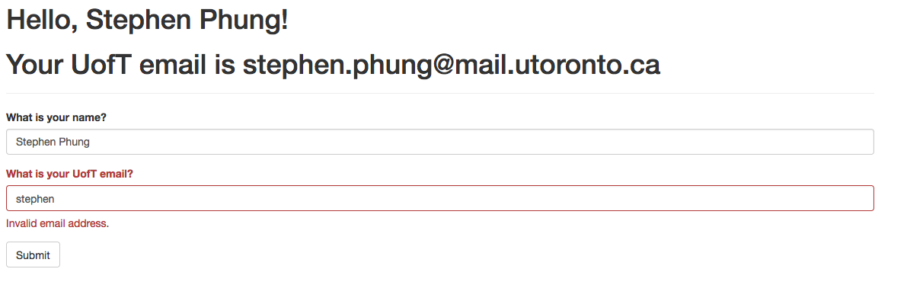

Stephen phung - This code is all from: https://github.com/miguelgrinberg/flasky

The screenshots for each part is included below:

Activity 2 

Activity 3 

Activity 4 Part 1 

Activity 4 Part 2 

Activity 4 Part 3 

Activity 4 Part 4 
